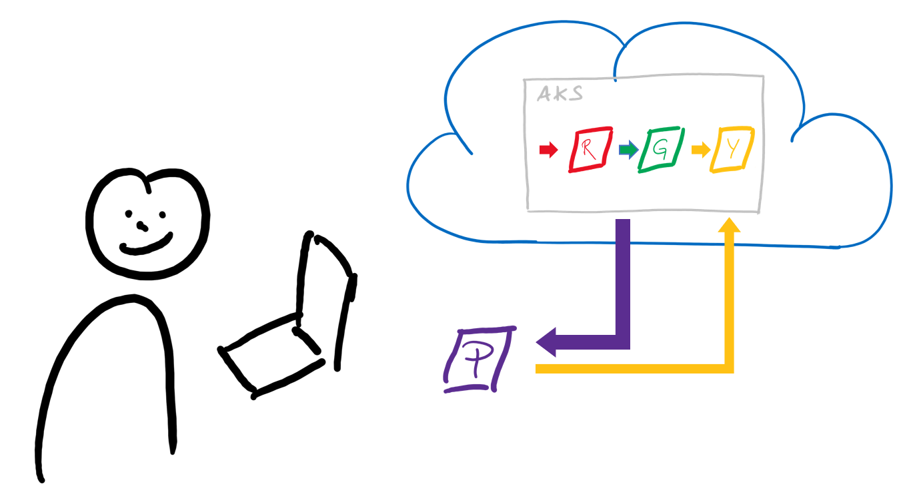
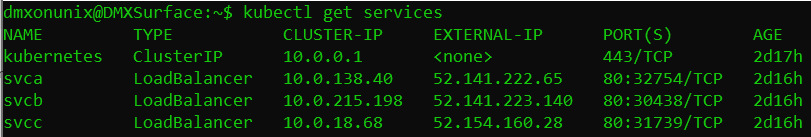
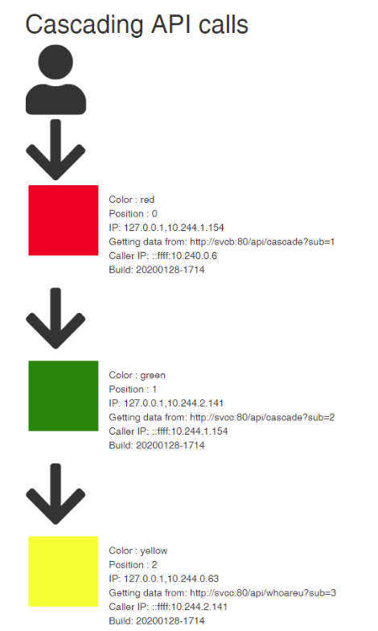
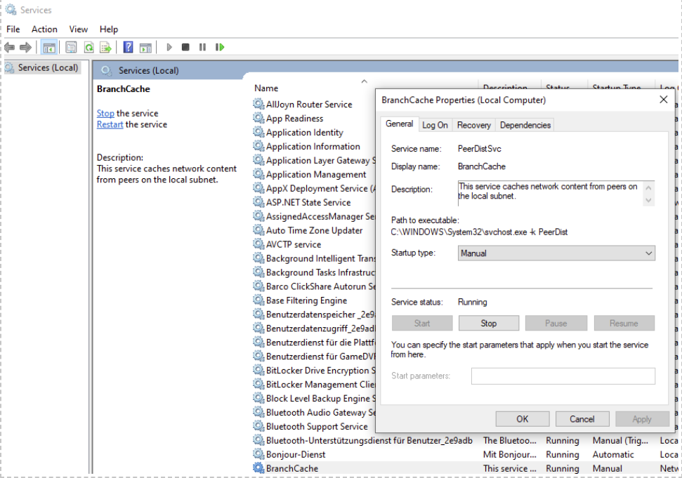
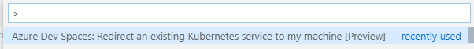
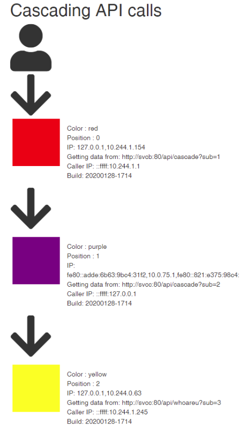

 # 10-minute Quick start: Improve debugging experience using Dev Spaces Connect 

 

## Objective of the lab: 
Dev Spaces Connect provides a workflow which embeds local running applications under development into a chain of requests inside a Kubernates cluster running in AKS. This allows for easier debugging and speeds up your inner loop because there is no need to build and push docker images to try our your application in the context of a cluster. 



 


 

## Prerequisites 

1. Deploy an AKS cluster, set up azure cli and configure kubectl to connect to your cluster following this guide: 
    https://docs.microsoft.com/en-us/azure/aks/kubernetes-walkthrough 

1. Install and configure Azure Dev Spaces for your cluster and connect with your local Azure Dev Spaces tooling (azds) to it using the default namespace following this guide: https://docs.microsoft.com/en-us/azure/dev-spaces/how-to/install-dev-spaces 


1. Install the Azure Dev Spaces extension for Visual Studio Code. https://marketplace.visualstudio.com/items?itemName=azuredevspaces.azds 

1. Install [Visual Studio Code](https://code.visualstudio.com/).
1. Install [NodeJS and NPM](https://nodejs.org/en/) to run the demo application.

 
## 1. Deploy the sample application 

1. The sourcecode for the sample application is located here: https://github.com/DanielMeixner/DebugContainer  

1. Deploy the sample appliction using the following yaml file 

```
kubectl apply –f https://raw.githubusercontent.com/DanielMeixner/DebugContainer/master/yamls/red-green-yellow.yaml 
```


 ## 2. Visit the currently running application  

1. Check out the services and pods running in the default namespace of your cluster.
```
kubectl get services
```
1. The result will look something like this.

**Hint**: *Don't be confused by the fact that all three services have external IPs. This is just for demo purposes to give direct access to instances if you want to investigate further. For this demo to work a single external IP on svca would be good enough.*


1. Notices the external IP for svca. 

    **Hint**: *If you don't find an external IP for svca and instead find "pending" wait a little and run kubectl get services again. Allocation of IP addresses can take moment.*

1. Open a browser and navigate to http://EXTERNAL-IP-OF-SERVICE-A/api/cascade .
 
1. The result should look like below.  



 

**Hint:** *Notice this visualization represents the chain of microservices which have been called: You triggered the red service (svca) which is in the backend calling the green service (svcb) which is then calling the yellow service (svc). All responses combined are used to build up the visualization.*  

## 3. Modify the source code of your current application 
 
1. As a developer you want to modify svcb. Clone the repository down to your machine using this command: 
    ```
    git clone https://github.com/DanielMeixner/DebugContainer 
    ```

1. Open the folder "DebugContainer"  in Visual Studio Code.

1. Modify the application. To keep things really simple, modify it to be purple instead of green. The color is being taken from an environment variable called COLOR. 

1. In Visual Studio Code open up the terminal (can be done in the menu by hitting Terminal --> New Terminal) and run “SET COLOR=purple” to set the environment variable. 

    ```
    SET COLOR=purple 
    ```

1. The port of the app is configured via environment variable as well. Run this command to set it to 8081. 
    ```
    SET MYPORT=8081 
    ```

1. To test this configuration run your application locally

1. Get the dependencies for the demo app using npm.
    ```
    npm install
    ```
1. Then run the app.
    ```    
    node server.js
    ```

1. The application starts up locally. When you open your browser and navigate to your app on http://localhost:8081 the app will simply display a simple purple website - the color was taken from your configuration. 

1. Stop the local running application by hitting Ctrl+C in the terminal.

 
## 4. Configure AKS to redirect to your developer machine 
1. While your application is working stand alone you can’t really be sure that it behaves as expected when being called from another service or when calling dependencies. What you want to have is an environment where you can do both accept incoming calls to your application and send outgoing requests  from your application without the need for any kind of mocking - you want to be  embedeed into a flow of actual running microservices. This is what we are going to do next.

1. **[WINDOWS ONLY]**  If you are running on Windows make sure you stop and disable the branchcache service if it is running. To do so press the windows key, type msc and hit return. In the Services dialog find the entry “BranchCache”. Right-click it, select properties.  

1. **[WINDOWS ONLY]** Set Startup type to “disabled” and hit “apply” to avoid an auto restart of the service. 

1. **[WINDOWS ONLY]** Then hit “Stop” to stop the service. 

    


1. Hit F1 in Visual Studio Code and run the command Azure *Dev Spaces: Redirect an existing Kubernetes service to my machine*. 

    

1. When asked for a service to redirect choose ***svcb*** - we want to embed our local running service into a chain of commands instead of ***svcb***.
1. When asked for mode select *replace* - we want to redirect the traffic which is targeting svcb in the cluster to our machine.
1. When asked for a port to redirect choose ***8081***. This is our  local port where our local running application will be listening.


1. **[WINDOWS ONLY]**  On Windows you might be asked to confirm the execution of azds via dialog. This is required because the local hosts file will be modified. 

1. It will take a few seconds and a new terminal will open in Visual Studio Code. This terminal is configured to work seamless with Azure Dev Spaces. You will find a lot of environment variables have been set in there already.

1. Provide some environment variables to configure the behaviour of our local application.We specify the color again and also specify information about the endpoint which shall be called by your local service.
In this case we are configuring the application to call an endpoint on http://svcc:80/api/whoareu .
Excute these commands in the terminal which has been opened automatically. (It's important to use this terminal and not another terminal for Dev Spaces Connect to work correctly.)
    ```
    SET SERVICEENDPOINTHOST=svcc
    SET SERVICEENDPOINTPATH=/api/whoareu
    SET SERVICEENDPOINTPORT=80
    SET MYPORT=8081
    SET COLOR=purple
    ```

1. As you can see the configuration is using an endpoint which is actually only valid inside of your AKS cluster – the hostname ***svcc*** typically doesn't resolve anywhere else. Because we are using the Azure Dev Spaces tooling the name of this backend endpoint will resolve correctly. 

1. Start the application in this terminal running “node server.js” in the same terminal. 
    ```
    node server.js
    ```

1. The client-side Azure Dev Spaces tooling will modify your machine in a way that traffic from within this terminal will be redirected to your cluster and name resolution of Kubernetes services will also work. Azure Dev Spaces server side tooling will make sure traffic towards ***svcb*** will be forwarded to your local developer machine. 

1. Open up the browser again with the public IP from svca, (http://PUBLIC-IP-OF-SERVICE-A>/api/cascade ) You should be able to see a vizualisation like this which proves your application running locally is now part of a chain of requests in AKS. As you see on the website your choice of color impacted the result and therefore proves that the traffic has been routed from AKS to your machine and back into the cluster.   
 
    
 
 
1. To disconnect your local machine from the cluster hit F1 in VSC and select Azure Dev Spaces: Disconnect current session. 

## What we've seen
In this tutorial we've seen how Dev Spaces Connect can help to speed up development of Kubernetes applications by allowing to integrate your developmer machine into the chain of requests in a microservices based application. This reduces the need for docker build/push loops and deployments to the cluster during development while you can continue to use your local developer tooling and debuggers.

## Learn more
If you are interested in learning more check out these links:
- General Overview for Dev Spaces 
   http://aka.ms/devspaces
- Setup of Dev Spaces Connect in detail https://docs.microsoft.com/en-us/azure/dev-spaces/how-to/connect
- How Dev Spaces works
    https://docs.microsoft.com/en-us/azure/dev-spaces/how-dev-spaces-works
- Dev Spaces Video https://www.youtube.com/watch?v=brhxU_kt2HI 


 

 
 